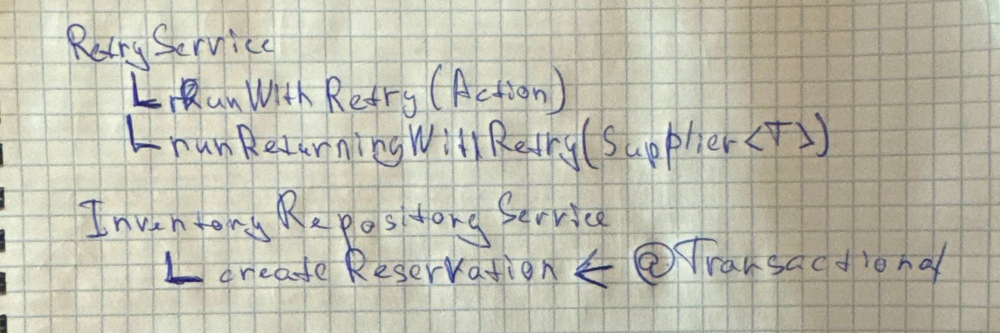

# Spring + PostgreSQL (OptimisticLocking) + Flyway + Integration tests

### Краткое представление
Проект представляет собой CRUD сервис резервирования товаров со следующими правилами:
1) Есть `product`, каждый из которых имеет некоторый stock (количество на складе)
2) Можно создавать `reservation` продукта (`POST /reservations?productId=XXX&quantity=YYY`):
   - `reservation.quantity` должен быть <= `product.stock`
   - `reservation` создается на 10 минут
   - Каждый созданный `reservation` уменьшает `product.stock` на `reservation.quantity`
   - Если за отведенные 10 минут не подтвердить резервацию (`POST /reservations/{id}/confirm`), то она отмениться автоматически, `product.stock` увеличится на `reservation.quantity`
   - Если резервацию подтвердить, то она заимеет статус `CONFIRMED` и пойдет в зачет статистики продукта
   - Также резервацию можно отменить (`POST /reservations/{id}/cancel`)
3) Ручка `GET /products/top-reserved` возвращает топ-5 продуктов, по сумме `reservation.quantity` за последние сутки со статусом `CONFIRMED` 
4) Ручка `GET /products/{id}` возвращает информацию о продукте


### Блокировки
Подразумевается, что сервисом будет пользоваться много юзеров, все из которых могут пытаться разом изменить `product.stock` одного товара, по-этому, для избежания проблем, была использована OptimisticLocking и транзакции с Retry

Поскольку просто обернуть метод сервиса в транзакцию ничего не даст (при retry while true будет внутри одной и той же транзакции), а также вызывать метод с @Transaction изнутри сервиса тоже не выйдет (метод будет срабатывать внутри сервиса, минуя SpringAOP), то для retry был создан отдельный retry сервис в package common, который вызывает все как положено через прокси spring-а, создавая для каждого retry вызова новую транзакцию, ниже краткая схема как это работает



(Можно было бы использовать @Retryable на методах сервиса, но мне было интересно разобраться, как именно делается retry)


### Индексы
Написал 2 индекса, каждый из которых оптимизирует тяжелые частые операции:

Индекс для составления ТОП-5 подтвержденных резерваций, product_id делает индекс covering (нет обращений в heap)
Дополнительно указываем условие, чтобы индекс покрывал только необходимую часть строк
```sql
CREATE INDEX idx_reservation_status_createdAt_productId
ON reservation(created_at, product_id)
WHERE status = 'CONFIRMED';
```

Индекс для поиска всех истекших резерваций, также partial индекс по статусу, сортируем по продукту и дате истечения,
product_id нужен для оптимизации optimistic locking. Тк система подразумевается высоконагруженной с кучей продуктов,
то запрос на очистку всех резерваций по всем продуктам одним махом будет очень трудновыполнимый
и постоянно ловящий OptimisticLockException (тк резервации меняют кол-во доступного товара в Product)
```sql
CREATE INDEX idx_reservation_status_productId_expiresAt
ON reservation(product_id, expires_at)
WHERE status = 'ACTIVE';
```

### Flyway и профили
Разделил профили на `prod` и `test`, каждый из которых отвечает за настройку разных бд и применение разных миграций (`prod` версия допом создает 20 случайных товаров и 1000 резерваций)

### Тесты
Написал интеграционный тест, запускающийся отдельно от приложения. Запускается через testcontainers, проверяет все бизнес-кейсы из ТЗ + дополнительные проверки. Подробнее описано в файле самого теста в JavaDoc

Для старта тестов необходимо запустить Docker и выполнить в корне проекта:
```shell
mvn clean test
```


### Запуск (docker)
Оркестрация настроена через docker-compose.yml, который поднимает контейнер с postgres:15 и моим приложением
Для запуска необходимо выполнить в консоли из корня проекта:
1) `docker compose build`
2) `docker compose up`

После запуска приложение будет доступно по адресу: `http://localhost:8080`

Остановка:
1) `docker compose down`

Готовые curl для теста (создать бронь / подтверждение по id / отклонение по id):
```shell
curl -X POST "http://localhost:8080/reservations?productId=XXX&quantity=YYY"
curl -X POST "http://localhost:8080/reservations/{reservationId}/confirm"
curl -X POST "http://localhost:8080/reservations/{reservationId}/cancel"
```

### Также
1) Возвращаю в ответе из сервисов dto-шки
2) Разделил абстракции и реализации
3) Прикрутил глобальный перехватывальщик ошибок
4) Красиво написал 🙂


Да, сделал сложнее требуемого.. Но это и не рабочая задача, а пет-проект песочница)
